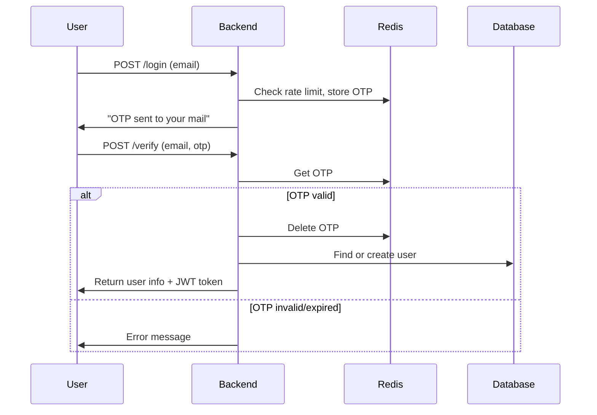

# User Verification Process (`/verify` Endpoint)

## Overview
The user verification process is designed to securely authenticate users using a One-Time Password (OTP) sent to their email. This process ensures that only users with access to the provided email can complete registration or login.

---

## Workflow

1. **User Requests OTP (`/login` endpoint)**
   - The user submits their email to the `/login` endpoint.
   - The backend checks Redis to enforce a rate limit (to prevent abuse).
   - If allowed, a 6-digit OTP is generated and stored in Redis with a 5-minute expiry.
   - The OTP is sent to the user's email via a message queue (RabbitMQ).

2. **User Submits OTP for Verification (`/verify` endpoint)**
   - The user submits their email and the OTP they received to the `/verify` endpoint.
   - The backend retrieves the OTP from Redis and compares it to the submitted value.
   - If the OTP is valid and not expired:
     - The OTP is deleted from Redis.
     - The backend checks if the user exists in the database; if not, a new user is created.
     - A JWT token is generated for the user.
     - The user details and token are returned in the response.
   - If the OTP is invalid or expired, an error is returned.

---

## Detailed Code Walkthrough

### 1. Route Setup
In `backend/user/src/routes/user.ts`:
```ts
router.post("/login", loginUser);
router.post("/verify", verifyUser);
```
- The `/verify` route is handled by the `verifyUser` controller.

### 2. Controller Logic
In `backend/user/src/controllers/user.ts`:
```ts
export const verifyUser = TryCatch(async (req, res) => {
  const { email, otp: enteredOtp } = req.body;

  if (!email || !enteredOtp) {
    res.status(400).json({ message: "Email and OTP Required" });
    return;
  }

  const otpKey = `otp:${email}`;
  const storedOtp = await redisClient.get(otpKey);

  if (!storedOtp || storedOtp !== enteredOtp) {
    res.status(400).json({ message: "Invalid or expired OTP" });
    return;
  }

  await redisClient.del(otpKey);

  let user = await User.findOne({ email });
  if (!user) {
    const name = email.slice(0, 8);
    user = await User.create({ name, email });
  }

  const token = generateToken(user);

  res.json({
    message: "User Verified",
    user,
    token,
  });
});
```

### 3. Step-by-Step Verification
- **Input Validation:** Checks if both email and OTP are provided.
- **OTP Retrieval:** Fetches the OTP from Redis using the key `otp:<email>`.
- **OTP Validation:** Compares the stored OTP with the one provided by the user.
- **OTP Cleanup:** Deletes the OTP from Redis after successful verification.
- **User Lookup/Creation:** Finds the user in the database or creates a new user if not found.
- **Token Generation:** Issues a JWT token for the user.
- **Response:** Returns a success message, user details, and the token.

---

## Sequence Diagram



---

## Summary Table

| Step                | Component   | Description                                      |
|---------------------|------------|--------------------------------------------------|
| Request OTP         | User/Backend| User requests OTP via `/login`                   |
| Store OTP           | Redis      | OTP stored with expiry, rate limit enforced      |
| Send OTP            | Backend    | OTP sent to user's email via RabbitMQ            |
| Verify OTP          | Backend    | User submits OTP via `/verify`                   |
| Validate OTP        | Redis      | OTP checked and deleted if valid                 |
| User Creation       | Database   | User created if not already present              |
| Token Generation    | Backend    | JWT token issued and returned                    |

---

## How to Use

1. **Request OTP:**  
   `POST /api/v1/login`  
   Body: `{ "email": "user@example.com" }`

2. **Verify OTP:**  
   `POST /api/v1/verify`  
   Body: `{ "email": "user@example.com", "otp": "123456" }`
