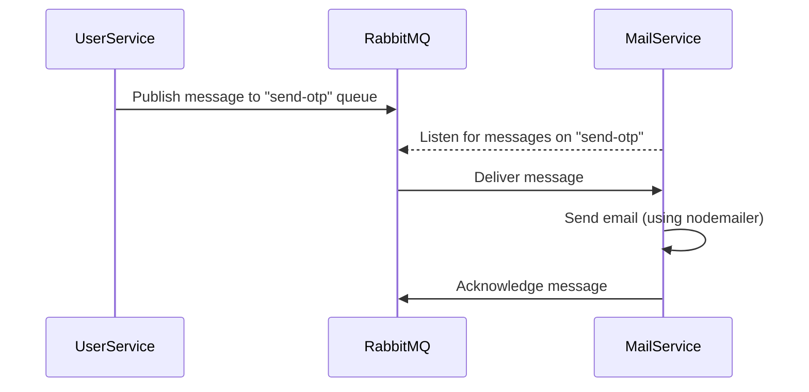

# RabbitMQ in This Project

## What is RabbitMQ?

RabbitMQ is a message broker: it helps different parts of your application (or different microservices) communicate with each other by sending messages through queues. This is especially useful in microservice architectures, where services need to work together but should remain independent.

---

## How RabbitMQ Works in This Project

Your project uses RabbitMQ to send messages between the **user service** and the **mail service**. Here's how it works:

### 1. Connecting to RabbitMQ

Both the user and mail services connect to RabbitMQ using the `amqplib` library. The connection details (host, username, password) are read from environment variables.

**Example (from `backend/user/src/config/rabbitmq.ts`):**
```ts
import amql from "amqplib";

let channel: amql.Channel;

export const connectRabbitMQ = async () => {
  const connection = await amql.connect({
    protocol: "amqp",
    hostname: process.env.Rabbitmq_Host,
    port: 5672,
    username: process.env.Rabbitmq_Username,
    password: process.env.Rabbitmq_Password,
  });
  channel = await connection.createChannel();
  // ...
};
```
- This code connects to RabbitMQ and creates a "channel" for communication.

---

### 2. Publishing Messages (User Service)

When the user service wants to trigger an action in another service (like sending an OTP email), it **publishes a message** to a queue.

**Example:**
```ts
export const publishToQueue = async (queueName: string, message: any) => {
  if (!channel) { /* ... */ }
  await channel.assertQueue(queueName, { durable: true });
  channel.sendToQueue(queueName, Buffer.from(JSON.stringify(message)), {
    persistent: true,
  });
};
```
- `publishToQueue` puts a message (like `{ to, subject, body }`) onto a named queue (e.g., `"send-otp"`).

---

### 3. Consuming Messages (Mail Service)

The mail service **listens** to the queue for new messages. When it receives a message, it processes it (e.g., sends an email).

**Example (from `backend/mail/src/consumer.ts`):**
```ts
const queueName = "send-otp";
await channel.assertQueue(queueName, { durable: true });
channel.consume(queueName, async (msg) => {
  if (msg) {
    const { to, subject, body } = JSON.parse(msg.content.toString());
    // send email using nodemailer
    channel.ack(msg); // acknowledge message as processed
  }
});
```
- The mail service waits for messages on the `"send-otp"` queue.
- When a message arrives, it reads the email details and sends the email.
- After sending, it acknowledges the message so RabbitMQ knows it was handled.

---

## The Flow in Simple Terms

1. **User Service**: Wants to send an OTP email → calls `publishToQueue("send-otp", { to, subject, body })`.
2. **RabbitMQ**: Holds the message in the `"send-otp"` queue.
3. **Mail Service**: Listens to `"send-otp"` queue → gets the message → sends the email.

---

## Why Use RabbitMQ?

- **Decoupling**: The user service doesn't need to know how emails are sent, or even if the mail service is running.
- **Reliability**: If the mail service is down, RabbitMQ will keep the message until it comes back up.
- **Scalability**: You can add more mail service instances to handle more emails.

---

## Summary Diagram



---

If you want to see how to trigger a message or how the services are started, check the respective service's `index.ts` files. You can also expand the system by adding new queues and consumers as needed.
